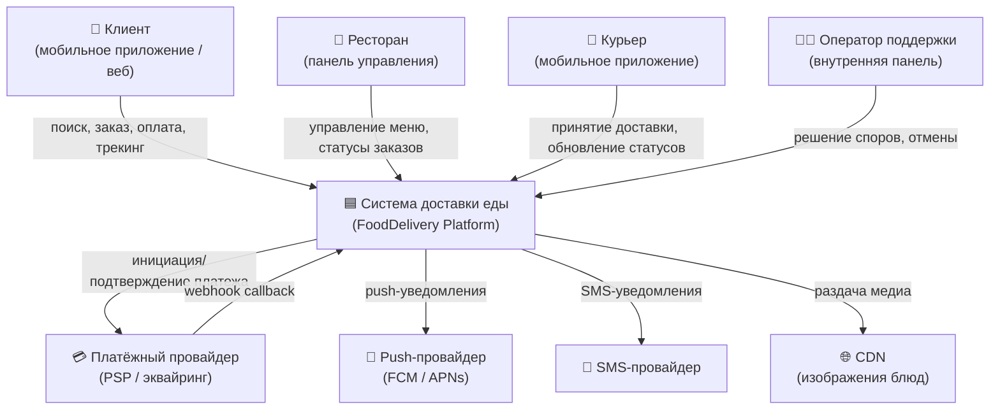
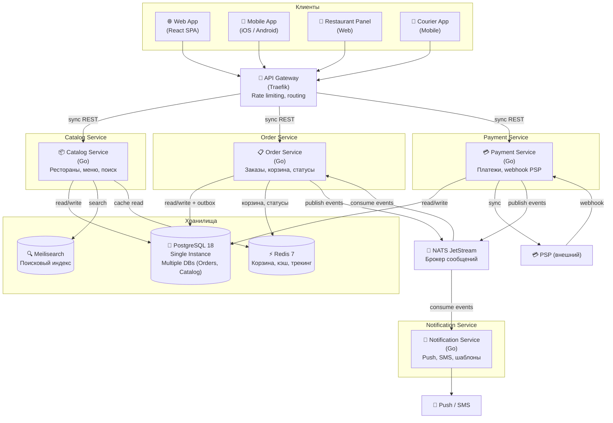
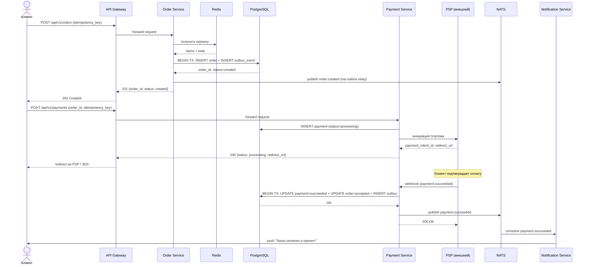
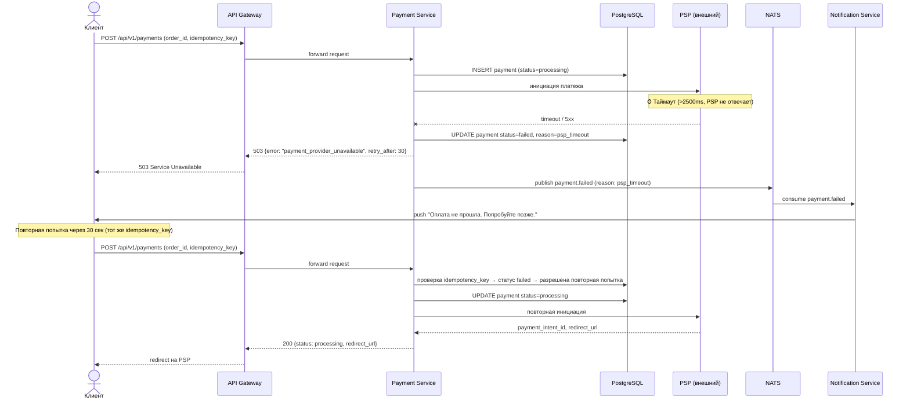
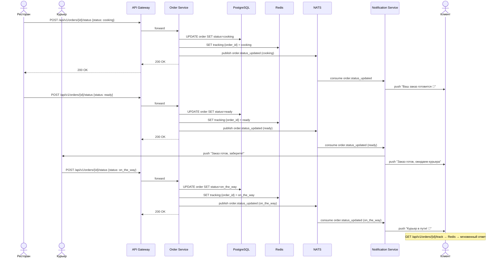

# Архитектура системы доставки еды

## 1. Архитектурный стиль + обоснование

**Выбран: Service-Based Architecture (SBA)** с элементами Event-Driven.

**Обоснование** (подробнее — [ADR-001](adr/001-architecture-style.md)):
- Маленькая команда и ограниченный бюджет исключают полноценные микросервисы (десятки пайплайнов).
- Монолит не обеспечит изоляцию контуров: при деградации поиска платежи должны работать (НФТ-006).
- SBA даёт 4 крупных сервиса вместо 10+ микросервисов — посильно для команды.
- Event-Driven элементы (NATS JetStream) обеспечивают at-least-once delivery для платёжных событий и decoupling уведомлений.

> [!NOTE]
> В данном документе представлена логическая архитектура. Техническая реализация для **production-ready** окружения (с учетом 3-AZ резервирования, Managed HA-кластеров и детального TCO) приведена в [operations.md](operations.md).

---

## 2. Компоненты системы (C4 L1 + L2)

### 2.1 C4 Level 1 — System Context



**Акторы:**
- **Клиент** — ищет рестораны, оформляет заказ, оплачивает, отслеживает доставку.
- **Ресторан** — управляет меню, принимает заказы, обновляет статусы готовки.
- **Курьер** — принимает доставку, обновляет геостатусы.
- **Оператор** — решает спорные случаи.

**Внешние системы:**
- **PSP** — обработка платежей, webhook-и.
- **Push/SMS провайдеры** — доставка уведомлений.
- **CDN** — раздача изображений блюд (~5.76 TB медиа).

### 2.2 C4 Level 2 — Container Diagram



### 2.3 Описание компонентов

| # | Компонент | Назначение | Технология | Коммуникация |
|---|-----------|-----------|------------|-------------|
| 1 | **API Gateway** | Маршрутизация, SSL, Rate limiting | Traefik OSS | sync (HTTP) |
| 2 | **Catalog Service** | Управление каталогом и поиск | Go | sync REST |
| 3 | **Order Service** | Корзина, заказы, статусы | Go | sync REST + async (NATS) |
| 4 | **Payment Service** | Платежи и идемпотентность | Go | sync REST + async (NATS) |
| 5 | **Notification Service** | Отправка уведомлений | Go | async (NATS consumer) |
| 6 | **PostgreSQL** | Source of Truth для всех сервисов (разные БД) | PostgreSQL 18 | sync (TCP) |
| 7 | **Meilisearch** | Поиск и фильтрация | Meilisearch | sync (HTTP) |
| 8 | **Redis** | Корзина, кэш, трекинг | Redis 7 | sync (TCP) |
| 9 | **NATS JetStream** | Брокер сообщений (At-least-once) | NATS | async (Pub/Sub) |

---

## 3. Sequence Diagrams

### 3.1 Happy Path — Оформление заказа и успешная оплата



### 3.2 Сценарий с ошибкой — Таймаут PSP



### 3.3 Асинхронный сценарий — Обновление статуса заказа и уведомления



---

## 4. API Design

**Подход к версионированию:** URI-based (`/api/v1/...`). При ломающих изменениях — `/api/v2/...` с параллельной поддержкой v1 в течение 3 месяцев.

### 4.1 Поиск ресторанов

```
GET /api/v1/search?q=пицца&cuisine=italian&sort=rating&limit=20&offset=0
```

**Response 200:**
```json
{
  "total": 142,
  "items": [
    {
      "restaurant_id": "uuid",
      "name": "Pizza House",
      "cuisine": ["italian", "fast_food"],
      "rating": 4.7,
      "delivery_time_min": 30,
      "delivery_fee": 149,
      "image_url": "https://cdn.example.com/restaurants/uuid/cover.jpg"
    }
  ]
}
```

**Errors:**
- `400` — невалидные параметры (limit > 100, неизвестный sort)
- `429` — rate limit exceeded
- `503` — поисковый индекс временно недоступен

### 4.2 Создание заказа

```
POST /api/v1/orders
Headers: Authorization: Bearer <token>, Idempotency-Key: <uuid>
```

**Request:**
```json
{
  "restaurant_id": "uuid",
  "items": [
    {"menu_item_id": "uuid", "quantity": 2, "options": ["extra_cheese"]},
    {"menu_item_id": "uuid", "quantity": 1}
  ],
  "delivery_address": {
    "lat": 55.75,
    "lon": 37.62,
    "address_text": "ул. Пушкина, д. 10, кв. 5"
  },
  "comment": "Не звонить, домофон 105"
}
```

**Response 201:**
```json
{
  "order_id": "uuid",
  "status": "created",
  "total_amount": 1250,
  "delivery_fee": 149,
  "estimated_delivery": "2026-05-01T18:30:00Z",
  "created_at": "2026-05-01T17:45:00Z"
}
```

**Errors:**
- `400` — невалидные данные (пустой items, невалидные координаты)
- `404` — ресторан не найден
- `409` — заказ с таким Idempotency-Key уже существует (возврат существующего)
- `422` — блюдо недоступно / ресторан закрыт
- `429` — rate limit exceeded

### 4.3 Инициация оплаты

```
POST /api/v1/payments
Headers: Authorization: Bearer <token>, Idempotency-Key: <uuid>
```

**Request:**
```json
{
  "order_id": "uuid",
  "payment_method": "card",
  "return_url": "https://app.example.com/orders/uuid/status"
}
```

**Response 200:**
```json
{
  "payment_id": "uuid",
  "status": "processing",
  "redirect_url": "https://psp.example.com/pay/intent_xxx",
  "amount": 1399
}
```

**Errors:**
- `400` — невалидный payment_method
- `404` — заказ не найден
- `409` — оплата уже инициирована (идемпотентность)
- `422` — заказ в некорректном статусе для оплаты
- `503` — платёжный провайдер недоступен (retry_after в заголовке)

### 4.4 Обновление статуса заказа

```
POST /api/v1/orders/{order_id}/status
Headers: Authorization: Bearer <token>
```

**Request:**
```json
{
  "status": "cooking"
}
```

**Response 200:**
```json
{
  "order_id": "uuid",
  "status": "cooking",
  "updated_at": "2026-05-01T17:50:00Z"
}
```

**Errors:**
- `400` — невалидный статус
- `403` — нет прав (только ресторан/курьер для своих заказов)
- `404` — заказ не найден
- `409` — невалидный переход статуса (например, `cooking` → `created`)

### 4.5 Трекинг заказа

```
GET /api/v1/orders/{order_id}/track
Headers: Authorization: Bearer <token>
```

**Response 200:**
```json
{
  "order_id": "uuid",
  "status": "on_the_way",
  "status_history": [
    {"status": "created", "at": "2026-05-01T17:45:00Z"},
    {"status": "accepted", "at": "2026-05-01T17:46:00Z"},
    {"status": "cooking", "at": "2026-05-01T17:50:00Z"},
    {"status": "ready", "at": "2026-05-01T18:10:00Z"},
    {"status": "courier_assigned", "at": "2026-05-01T18:11:00Z"},
    {"status": "on_the_way", "at": "2026-05-01T18:15:00Z"}
  ],
  "estimated_delivery": "2026-05-01T18:30:00Z"
}
```

**Errors:**
- `403` — нет доступа к чужому заказу
- `404` — заказ не найден

---

## 5. Выбор БД и модель данных

Подробное обоснование — [ADR-002](adr/002-database-choice.md).

### 5.1 Обзор хранилищ

| Хранилище | Технология | Назначение | Обоснование |
|-----------|-----------|-----------|-------------|
| Orders DB | PostgreSQL 18 (БД `orders_db`) | Заказы, платежи, outbox | ACID, RPO=0, идемпотентность через unique constraint |
| Catalog DB | PostgreSQL 18 (БД `catalog_db`) | Рестораны, меню, блюда | Структурированные данные со связями, source of truth |
| Search Index | Meilisearch | Поиск и фильтрация | Лёгкий (Rust), typo-tolerance, фасетные фильтры |
| Cache / Sessions | Redis 7 | Корзина, кэш, трекинг | In-memory, TTL, sub-ms latency |

> **Примечание:** Orders DB и Catalog DB — это разные **логические базы данных** внутри одного инстанса PostgreSQL 18 ([ADR-004](adr/004-resource-optimization.md)).

### 5.2 Модель данных — основные сущности
### Синхронизация данных
Для обеспечения консистентности и отказоустойчивости используются следующие паттерны:
- **Leader-Follower (PG, Meilisearch)**: Один узел отвечает за запись и транслирует изменения остальным. В случае Meilisearch реализовано прозрачное проксирование записей с Follower на Leader.
- **Quorum/Consensus (Valkey, NATS)**: Гарантия сохранности данных через подтверждение большинством узлов (Raft-like).

#### Таблица `orders` (PostgreSQL — `orders_db`)

| Поле | Тип | Описание |
|------|-----|----------|
| `id` | UUID v7, **PK** | Идентификатор заказа |
| `user_id` | UUID v7, NOT NULL | FK → users (логический) |
| `restaurant_id` | UUID v7, NOT NULL | FK → restaurants (логический, cross-DB) |
| `status` | VARCHAR(32) | created / accepted / cooking / ready / ... |
| `items_json` | JSONB | Снимок позиций заказа на момент оформления |
| `total_amount` | INTEGER | Сумма в копейках |
| `delivery_fee` | INTEGER | Стоимость доставки |
| `delivery_address` | JSONB | {lat, lon, address_text} |
| `comment` | TEXT | Комментарий клиента |
| `idempotency_key` | UUID v7, **UNIQUE** | Ключ идемпотентности |
| `created_at` | TIMESTAMPTZ | Время создания |
| `updated_at` | TIMESTAMPTZ | Время последнего обновления |

**Индексы:**
- `idx_orders_user_id` (user_id) — история заказов пользователя
- `idx_orders_restaurant_id` (restaurant_id) — заказы ресторана
- `idx_orders_status` (status) WHERE status NOT IN ('delivered','cancelled') — активные заказы
- `UNIQUE(idempotency_key)` — идемпотентность

**Объём:** ~21.9 млн записей/год, ~26 GB/год (без индексов).

#### Таблица `payments` (PostgreSQL — `orders_db`)

| Поле | Тип | Описание |
|------|-----|----------|
| `id` | UUID v7, **PK** | Идентификатор платежа |
| `order_id` | UUID v7, **FK** → orders | Связь с заказом |
| `status` | VARCHAR(32) | processing / succeeded / failed / refunding / refunded |
| `amount` | INTEGER | Сумма в копейках |
| `payment_intent_id` | VARCHAR(255), **UNIQUE** | ID от PSP |
| `idempotency_key` | UUID v7, **UNIQUE** | Ключ идемпотентности |
| `failure_reason` | TEXT | Причина ошибки (nullable) |
| `created_at` | TIMESTAMPTZ | |
| `updated_at` | TIMESTAMPTZ | |

**Индексы:**
- `idx_payments_order_id` (order_id) — платежи заказа
- `UNIQUE(payment_intent_id)` — дедупликация webhook-ов PSP
- `UNIQUE(idempotency_key)` — идемпотентность

**Объём:** ~21.9 млн записей/год, ~17.5 GB/год.

#### Таблица `restaurants` (PostgreSQL — `catalog_db`)

| Поле | Тип | Описание |
|------|-----|----------|
| `id` | UUID v7, **PK** | |
| `name` | VARCHAR(255) | Название |
| `cuisine` | TEXT[] | Массив типов кухни |
| `rating` | NUMERIC(2,1) | Средний рейтинг |
| `delivery_time_min` | INTEGER | Среднее время доставки (мин) |
| `is_active` | BOOLEAN | Активен ли ресторан |
| `address` | JSONB | Адрес и координаты |
| `created_at` | TIMESTAMPTZ | |

**Индексы:**
- `idx_restaurants_cuisine` GIN (cuisine) — фильтрация по кухне
- `idx_restaurants_is_active` (is_active) WHERE is_active = true — только активные
- `idx_restaurants_rating` (rating DESC) — сортировка по рейтингу

**Объём:** ~200,000 записей, ~200 MB.

#### Таблица `menu_items` (PostgreSQL — `catalog_db`)

| Поле | Тип | Описание |
|------|-----|----------|
| `id` | UUID v7, **PK** | |
| `restaurant_id` | UUID v7, **FK** → restaurants | |
| `name` | VARCHAR(255) | Название блюда |
| `description` | TEXT | Описание |
| `price` | INTEGER | Цена в копейках |
| `category` | VARCHAR(100) | Категория (основные, десерты...) |
| `is_available` | BOOLEAN | В наличии |
| `image_urls` | TEXT[] | Ссылки на CDN |
| `options` | JSONB | Доп. опции (extra_cheese и т.д.) |

**Индексы:**
- `idx_menu_items_restaurant_id` (restaurant_id) — меню ресторана (основной паттерн доступа)
- `idx_menu_items_available` (restaurant_id, is_available) WHERE is_available = true

**Объём:** ~16 млн записей (200k × 80), ~9.6 GB.

#### Таблица `outbox_events` (PostgreSQL — `orders_db`)

| Поле | Тип | Описание |
|------|-----|----------|
| `id` | BIGSERIAL, **PK** | |
| `aggregate_type` | VARCHAR(50) | order / payment |
| `aggregate_id` | UUID v7 | ID заказа или платежа |
| `event_type` | VARCHAR(100) | order.created, payment.succeeded, ... |
| `payload` | JSONB | Тело события |
| `published` | BOOLEAN DEFAULT FALSE | Опубликовано ли в NATS |
| `created_at` | TIMESTAMPTZ | |

**Индексы:**
- `idx_outbox_unpublished` (published, created_at) WHERE published = false — relay-процесс забирает неотправленные

### 5.3 Стратегия генерации ID (UUID v7)

Для всех основных сущностей (заказы, платежи, рестораны) в качестве первичных ключей (PK) выбраны **UUID v7**.

**Обоснование:**
- **K-sortable (временная упорядоченность):** В отличие от классических UUID v4, v7 содержит в себе Timestamp. Это решает главную проблему UUID в базах данных — деградацию производительности B-tree индексов из-за случайного распределения данных (фрагментация индекса).
- **Нативная поддержка:** Выбрана версия **PostgreSQL 18**, где UUID v7 поддерживается «из коробки», что позволяет эффективно хранить и индексировать эти данные без сторонних расширений.
- **Производительность vs BIGINT:** Хотя `BIGINT` (8 байт) быстрее при сравнении, чем `UUID` (16 байт), использование UUID v7 в PostgreSQL (тип `uuid`) дает почти сопоставимую скорость вставки за счет последовательности, при этом сохраняя преимущества UUID.
- **Генерация на стороне клиента:** Позволяет безопасно генерировать ID до отправки в БД (удобно для идемпотентности и распределенных систем) без риска коллизий или необходимости обращения к централизованному счетчику.
- **Безопасность:** Отсутствие предсказуемости (как в случае с `BIGINT` 1, 2, 3...) затрудняет конкурентам анализ объема заказов через ID в URL.

Подробнее о паттерне outbox — [ADR-003](adr/003-payment-reliability.md).

---

## 6. Ссылки на ADR

| ADR | Тема | Ссылка |
|-----|------|--------|
| ADR-001 | Выбор архитектурного стиля (SBA) | [docs/adr/001-architecture-style.md](adr/001-architecture-style.md) |
| ADR-002 | Выбор баз данных | [docs/adr/002-database-choice.md](adr/002-database-choice.md) |
| ADR-003 | Надёжность платежей (Transactional Outbox + Idempotency) | [docs/adr/003-payment-reliability.md](adr/003-payment-reliability.md) |
| ADR-004 | Оптимизация под ограниченные ресурсы (2 vCPU, 8 GB) | [docs/adr/004-resource-optimization.md](adr/004-resource-optimization.md) |
