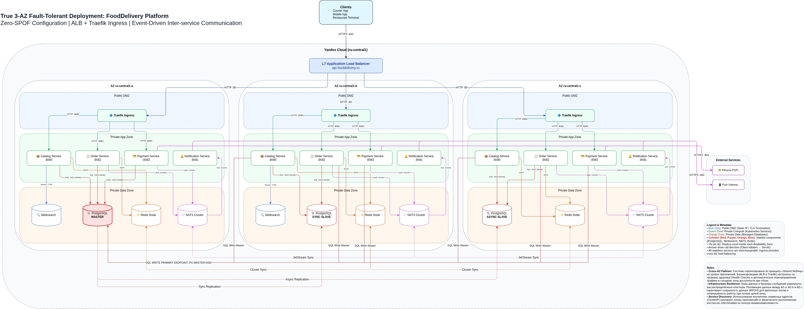

# Deployment Diagram — FoodDelivery Platform

Каноническая deployment-диаграмма в формате Draw.io. Показывает физическое размещение сервисов по зонам доступности, сетевые зоны, направления связей и используемые протоколы/порты.

## Визуализация

> **Примечание:** Для редактирования используйте файл [deployment.drawio](./deployment_diagram.drawio) в приложении diagrams.net (draw.io).

## Сетевая топология

| Зона | CIDR | Назначение |
| :--- | :--- | :--- |
| **Regional Layer** | - | L7 ALB (Application Load Balancer) |
| **Public Zone (DMZ)** | `10.128.0.0/16` | Traefik Ingress, NAT Gateways |
| **Private App Zone** | `10.128.1.0/24`, `10.129.1.0/24`, `10.130.1.0/24` | Микросервисы (Catalog, Order, etc.) |
| **Private Data Zone** | `10.128.2.0/24`, `10.129.2.0/24`, `10.130.2.0/24` | Хранилища (PG, Valkey, NATS, Meili) |

## Адресация

| Компонент | FQDN / Адрес | Порт | Протокол | Комментарий |
| :--- | :--- | :--- | :--- | :--- |
| **ALB (External)** | `api.fooddelivery.ru` | `:443` | HTTPS | Публичный вход (Static IP) |
| **Traefik** | `traefik.svc.cluster.local` | `:80` | HTTP | Ingress внутри DMZ |
| **Catalog** | `catalog.svc.cluster.local` | `:8080` | HTTP/gRPC | Поиск и меню |
| **Order** | `order.svc.cluster.local` | `:8082` | HTTP/gRPC | Оформление заказов |
| **Payment** | `payment.svc.cluster.local` | `:8083` | HTTP/gRPC | Обработка платежей |
| **PostgreSQL** | `postgres.db.internal` | `:5432` | SQL | HA Cluster (Master + 2 Replicas) |
| **Valkey** | `valkey.infra.internal` | `:6379` | RESP | Cluster / Caching |
| **NATS** | `nats.infra.internal` | `:4222` | NATS | Event Bus (JetStream) |
| **Meilisearch** | `meilisearch.internal` | `:7700` | HTTP | Поисковый индекс |

> **Примечание:** Эфемерные IP подов K8s и autoscaling-инстансов не указываются — они управляются оркестратором.

## Обоснование топологии (Why 3 AZ?)
Выбор 3-зонной архитектуры обусловлен следующими факторами:
1.  **Quorum & Consensus**: Для корректной работы кворумных систем (NATS JetStream, Valkey Cluster) требуется нечетное количество узлов (минимум 3). Размещение их в разных AZ исключает ситуацию "split-brain" при отказе одной зоны.
2.  **High Availability (99.95%)**: Использование 3 AZ позволяет системе выдерживать полный отказ одного дата-центра без потери доступности для записи.
3.  **Fault Tolerance (Meilisearch)**: Развертывание 3 узлов Meilisearch обеспечивает непрерывную работу поиска даже при отказе любой из зон доступности.
4.  **Cloud Native Best Practices**: Yandex Cloud предоставляет нативную поддержку распределения ресурсов по 3 зонам (ru-central1-a/b/c), что позволяет реализовать HA-схему с минимальными накладными расходами.
