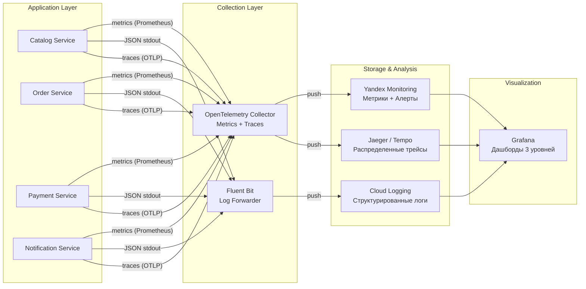
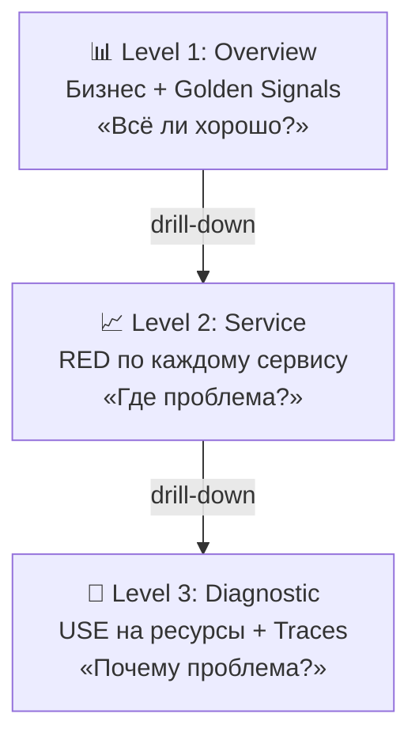

# Observability Architecture — FoodDelivery Platform

Стек наблюдаемости и визуализация потоков метрик, логов и трейсов.

## Общая архитектура сбора сигналов

## Иерархия дашбордов
Иерархия из 3 уровней выбрана для минимизации **MTTR** (Mean Time To Resolution) путем последовательного сужения области поиска проблемы.

## Алерты: Golden Signals
Ниже приведены основные алерты для критического пути (Checkout):

| Сигнал | Метрика (PromQL-like) | Порог | Описание |
| :--- | :--- | :--- | :--- |
| **Latency** | `histogram_quantile(0.99, rate(http_request_duration_seconds_bucket{service="order", route="POST /orders"}[5m]))` | `> 0.5s` | Рост задержки на чекауте. |
| **Errors** | `sum(rate(http_requests_total{service="payment", status=~"5.."}[5m])) / sum(rate(http_requests_total{service="payment"}[5m]))` | `> 1%` | Ошибки оплаты. |
| **Traffic** | `sum(rate(http_requests_total{route="/orders"}[5m]))` | `< 50%` от нормы | Резкое падение входящего трафика. |
| **Saturation** | `nats_jetstream_consumer_lag{consumer="payment-worker"}` | `> 10 000` | Накопление очереди в брокере. |

1.  **Level 1: Overview** (Для SRE/Management):
    *   **Бизнес**: GMV (₽/мин), кол-во заказов, активные пользователи.
    *   **Health**: Общий Error Rate (%), SLI/SLO burn-rate.
    *   **Infrastructure**: Ключевой кворум (PG, Redis, NATS) и replication lag.

2.  **Level 2: Service** (Для разработчиков):
    *   **RED-паттерн**: Rate (RPS), Errors (4xx/5xx), Duration (p50/p95/p99).
    *   **Зависимости**: Задержки внешних API (PSP, Push), время ответа БД.
    *   **Ресурсы**: Replicas count, restarts, memory/CPU usage по подам.

3.  **Level 3: Diagnostic** (Для глубокой отладки):
    *   **USE-паттерн**: Utilization, Saturation, Errors для узлов K8s и дисков.
    *   **DB Internal**: Locks, Slow queries, Cache hit ratio, WAL activity.
    *   **Tracing**: Глубокие трейсы (Jaeger/Tempo) с детализацией по span-ам.

## Логирование

### Формат и хранение
Логи пишутся в **JSON** (структурное логирование) и собираются в централизованное хранилище (Cloud Logging / ELK).

### Обязательные поля
*   `ts`: timestamp (ISO8601 UTC).
*   `level`: DEBUG, INFO, WARN, ERROR.
*   `service`: имя микросервиса.
*   `trace_id`: для сквозного отслеживания запроса.
*   `msg`: человекочитаемое сообщение.
*   `env`: prod/stage.

### Что логируем
*   **Входящие запросы**: Метод, путь, статус-код, время выполнения (duration).
*   **События заказа**: Смена статусов (`PENDING -> PAID -> DELIVERED`).
*   **Интеграции**: Ошибки вызова внешних API (без тел запросов).
*   **Миграции**: Старт и результат выполнения миграций БД.

### Что НЕ логируем (PII & Security)
*   Пароли и хэши паролей.
*   Полные номера карт, CVV.
*   JWT и API-ключи.
*   **PII**: Персональные данные (email, телефон, полный адрес) должны маскироваться или заменяться на `user_id_hash`.
